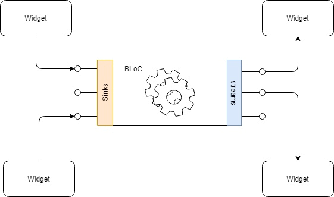
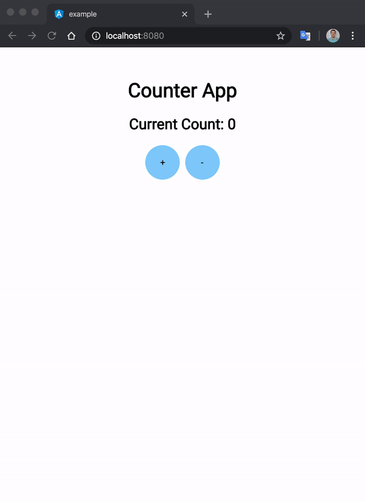
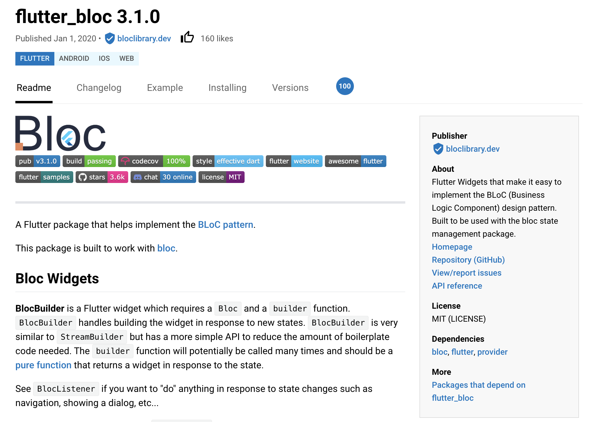
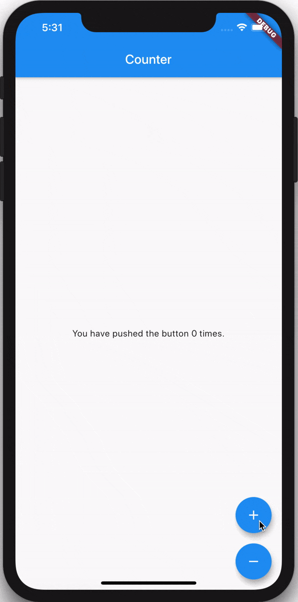
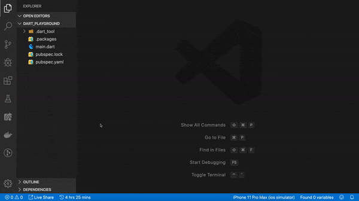
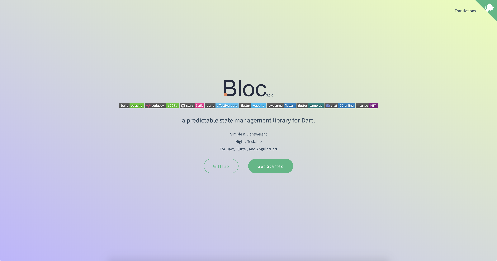
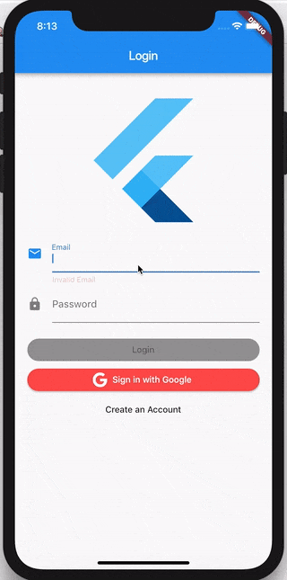
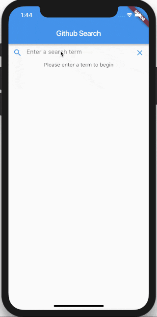
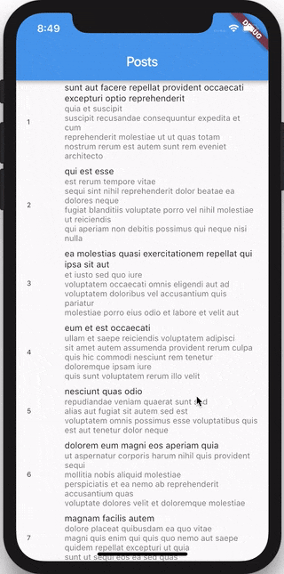
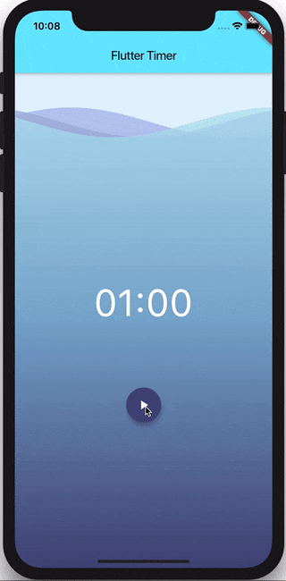

footer: @felangelov - flutter europe 2020
slidenumbers: true

# Bloc Library: Basics & Beyond 🚀

### Felix Angelov @ Very Good Ventures

---

# Very Good Ventures, Chicago 🕶️🦄


^ opened an office with my friend/teammate, Jorge. if interested in learning more about VGV reach out.

---

# about me

 

^ started at BMW about 4 years ago. using flutter for last 2 years. rebuild BMW mobile app in Flutter. joined VGV in Jan.

---


[.footer: https://www.looper.com/175737/the-best-reactions-to-the-mandalorians-baby-yoda/]

^ so rewind 2 years, we were asked to rewrite the BMW app in Flutter. we had to get it right

---

# Goals

☐ decouple UI & business logic

☐ easy to test

☐ predictable/maintainable

---

# In the beginning...



---

# When you use Rx for the first time


[.footer: https://techcrunch.com/2019/11/21/tesla-accidentally-busted-two-windows-on-the-cybertruck-while-demonstrating-how-tough-they-are/]

---


---

# Goals

**☐ decouple UI & business logic**

☐ easy to test

☐ predictable/maintainable

---

# Overview


> A bloc converts incoming events into outgoing states.

---

# Real-World


---

# Real-World: Increment


---

# package:bloc

```yaml
name: counter_bloc
description: A counter bloc example
version: 1.0.0

environment:
  sdk: ">=2.0.0 <3.0.0"

dependencies:
  bloc: ^3.0.0
```

---

[.code-highlight: 8-9]

# package:bloc

```yaml
name: counter_bloc
description: A counter bloc example
version: 1.0.0

environment:
  sdk: ">=2.0.0 <3.0.0"

dependencies:
  bloc: ^3.0.0
```

---

# Bloc Anatomy

```dart
import 'dart:async';
import 'package:bloc/bloc.dart';
```

---

# Bloc Anatomy

[.code-highlight: 4]

```dart
import 'dart:async';
import 'package:bloc/bloc.dart';

enum CounterEvent { increment, decrement }
```

---

# Bloc Anatomy

[.code-highlight: 6]

```dart
import 'dart:async';
import 'package:bloc/bloc.dart';

enum CounterEvent { increment, decrement }

class CounterBloc extends Bloc<CounterEvent, int> {}
```

---

# Bloc Anatomy

[.code-highlight: 7-8]

```dart
import 'dart:async';
import 'package:bloc/bloc.dart';

enum CounterEvent { increment, decrement }

class CounterBloc extends Bloc<CounterEvent, int> {
    @override
    int get initialState => 0;
}
```

---

# Bloc Anatomy

[.code-highlight: 6-9]

```dart
...

class CounterBloc extends Bloc<CounterEvent, int> {
    ...

    @override
    Stream<int> mapEventToState(CounterEvent event) async* {

    }
}
```

---

# Bloc Anatomy

[.code-highlight: 8-10]

```dart
...

class CounterBloc extends Bloc<CounterEvent, int> {
    ...

    @override
    Stream<int> mapEventToState(CounterEvent event) async* {
        switch (event) {

        }
    }
}
```

---

# Bloc Anatomy

[.code-highlight: 9-11]

```dart
...

class CounterBloc extends Bloc<CounterEvent, int> {
    ...

    @override
    Stream<int> mapEventToState(CounterEvent event) async* {
        switch (event) {
            case CounterEvent.increment:
                yield state + 1;
                break;
        }
    }
}
```

---

# Bloc Anatomy

[.code-highlight: 12-14]

```dart
...

class CounterBloc extends Bloc<CounterEvent, int> {
    ...

    @override
    Stream<int> mapEventToState(CounterEvent event) async* {
        switch (event) {
            case CounterEvent.increment:
                yield state + 1;
                break;
            case CounterEvent.decrement:
                yield state - 1;
                break;
        }
    }
}
```

---

# Bloc Anatomy

```dart
import 'dart:async';
import 'package:bloc/bloc.dart';

enum CounterEvent { increment, decrement }

class CounterBloc extends Bloc<CounterEvent, int> {
    @override
    int get initialState => 0;

    @override
    Stream<int> mapEventToState(CounterEvent event) async* {
        switch (event) {
            case CounterEvent.increment:
                yield state + 1;
                break;
            case CounterEvent.decrement:
                yield state - 1;
                break;
        }
    }
}
```

---

# Bloc in Action

```dart
import 'counter_bloc.dart';

void main() {
    final counterBloc = CounterBloc();

    counterBloc.listen(print);

    counterBloc.add(CounterEvent.increment);
    counterBloc.add(CounterEvent.decrement);
}
```

---

# Bloc in Action

[.code-highlight: 1]

```dart
import 'counter_bloc.dart';

void main() {
    final counterBloc = CounterBloc();

    counterBloc.listen(print);

    counterBloc.add(CounterEvent.increment);
    counterBloc.add(CounterEvent.decrement);
}
```

---

# Bloc in Action

[.code-highlight: 4]

```dart
import 'counter_bloc.dart';

void main() {
    final counterBloc = CounterBloc();

    counterBloc.listen(print);

    counterBloc.add(CounterEvent.increment);
    counterBloc.add(CounterEvent.decrement);
}
```

---

# Bloc in Action

[.code-highlight: 6]

```dart
import 'counter_bloc.dart';

void main() {
    final counterBloc = CounterBloc();

    counterBloc.listen(print);

    counterBloc.add(CounterEvent.increment);
    counterBloc.add(CounterEvent.decrement);
}
```

---

# Bloc in Action

[.code-highlight: 8]

```dart
import 'counter_bloc.dart';

void main() {
    final counterBloc = CounterBloc();

    counterBloc.listen(print);

    counterBloc.add(CounterEvent.increment);
    counterBloc.add(CounterEvent.decrement);
}
```

---

# Bloc in Action

[.code-highlight: 9]

```dart
import 'counter_bloc.dart';

void main() {
    final counterBloc = CounterBloc();

    counterBloc.listen(print);

    counterBloc.add(CounterEvent.increment);
    counterBloc.add(CounterEvent.decrement);
}
```

---

# Bloc in Action

```sh
$ dart example/main.dart
0
1
0
```

---

# Bloc in Action

[.code-highlight: 1]

```sh
$ dart example/main.dart
0
1
0
```

---

# Bloc in Action

[.code-highlight: 2]

```sh
$ dart example/main.dart
0 // initialState
1
0
```

---

# Bloc in Action

[.code-highlight: 3]

```sh
$ dart example/main.dart
0
1 // CounterEvent.increment
0
```

---

# Bloc in Action

[.code-highlight: 4]

```sh
$ dart example/main.dart
0
1
0 // CounterEvent.decrement
```

---

# Separation of Concerns


---




---

# Goals

**☑️ decouple UI & business logic**

☐ easy to test

☐ predictable/maintainable

---

# Goals

☑️ decouple UI & business logic

**☐ easy to test**

☐ predictable/maintainable

---

# package:bloc_test

```yaml
name: counter_bloc
description: A counter bloc example
version: 1.0.0

environment:
  sdk: ">=2.0.0 <3.0.0"

dependencies:
  bloc: ^3.0.0

dev_dependencies:
  test: ^1.11.1
  bloc_test: ^3.0.0
```

---

[.code-highlight: 11-13]

# package:bloc_test

```yaml
name: counter_bloc
description: A counter bloc example
version: 1.0.0

environment:
  sdk: ">=2.0.0 <3.0.0"

dependencies:
  bloc: ^3.0.0

dev_dependencies:
  test: ^1.11.1
  bloc_test: ^3.0.0
```

---

# bloc_test Anatomy

```dart
import 'package:test/test.dart';
import 'package:bloc_test/bloc_test.dart';

import '../counter_bloc.dart';

void main() {
  group('CounterBloc', () {
    blocTest(
      'emits [0] when no events are added',
      build: () => CounterBloc(),
      expect: [0],
    );
  });
}
```

---

[.code-highlight: 6,14]

# bloc_test Anatomy

```dart
import 'package:test/test.dart';
import 'package:bloc_test/bloc_test.dart';

import '../counter_bloc.dart';

void main() {
  group('CounterBloc', () {
    blocTest(
      'emits [0] when no events are added',
      build: () => CounterBloc(),
      expect: [0],
    );
  });
}
```

---

[.code-highlight: 1, 7, 13]

# bloc_test Anatomy

```dart
import 'package:test/test.dart';
import 'package:bloc_test/bloc_test.dart';

import '../counter_bloc.dart';

void main() {
  group('CounterBloc', () {
    blocTest(
      'emits [0] when no events are added',
      build: () => CounterBloc(),
      expect: [0],
    );
  });
}
```

---

[.code-highlight: 2, 4, 8-12]

# bloc_test Anatomy

```dart
import 'package:test/test.dart';
import 'package:bloc_test/bloc_test.dart';

import '../counter_bloc.dart';

void main() {
  group('CounterBloc', () {
    blocTest(
      'emits [0] when no events are added',
      build: () => CounterBloc(),
      expect: [0],
    );
  });
}
```

---

[.code-highlight: 9]

# bloc_test Anatomy

```dart
import 'package:test/test.dart';
import 'package:bloc_test/bloc_test.dart';

import '../counter_bloc.dart';

void main() {
  group('CounterBloc', () {
    blocTest(
      'emits [0] when no events are added',
      build: () => CounterBloc(),
      expect: [0],
    );
  });
}
```

---

[.code-highlight: 10]

# bloc_test Anatomy

```dart
import 'package:test/test.dart';
import 'package:bloc_test/bloc_test.dart';

import '../counter_bloc.dart';

void main() {
  group('CounterBloc', () {
    blocTest(
      'emits [0] when no events are added',
      build: () => CounterBloc(),
      expect: [0],
    );
  });
}
```

---

[.code-highlight: 11]

# bloc_test Anatomy

```dart
import 'package:test/test.dart';
import 'package:bloc_test/bloc_test.dart';

import '../counter_bloc.dart';

void main() {
  group('CounterBloc', () {
    blocTest(
      'emits [0] when no events are added',
      build: () => CounterBloc(),
      expect: [0],
    );
  });
}
```

---

# bloc_test Anatomy

```dart
import 'package:test/test.dart';
import 'package:bloc_test/bloc_test.dart';

import '../counter_bloc.dart';

void main() {
  group('CounterBloc', () {
    blocTest(
      'emits [0] when no events are added',
      build: () => CounterBloc(),
      expect: [0],
    );
  });
}
```

---

# bloc_test in Action

```sh
$ pub run test
✓ CounterBloc emits [0] when no events are added
00:01 +1: All tests passed!
```

---

[.code-highlight: 1]

# bloc_test in Action

```sh
$ pub run test
✓ CounterBloc emits [0] when no events are added
00:01 +1: All tests passed!
```

---

[.code-highlight: 2]

# bloc_test in Action

```sh
$ pub run test
✓ CounterBloc emits [0] when no events are added
00:01 +1: All tests passed!
```

---

[.code-highlight: 3]

# bloc_test in Action

```sh
$ pub run test
✓ CounterBloc emits [0] when no events are added
00:01 +1: All tests passed!
```

---

# One More Time

```dart
import 'package:test/test.dart';
import 'package:bloc_test/bloc_test.dart';

import '../counter_bloc.dart';

void main() {
  group('CounterBloc', () {
    ...

    blocTest(
      'emits [0, 1] when CounterEvent.increment is added',
      build: () => CounterBloc(),
      act: (counterBloc) => counterBloc.add(CounterEvent.increment),
      expect: [0, 1],
    );
  });
}

```

---

[.code-highlight: 10-15]

# One More Time

```dart
import 'package:test/test.dart';
import 'package:bloc_test/bloc_test.dart';

import '../counter_bloc.dart';

void main() {
  group('CounterBloc', () {
    ...

    blocTest(
      'emits [0, 1] when CounterEvent.increment is added',
      build: () => CounterBloc(),
      act: (counterBloc) => counterBloc.add(CounterEvent.increment),
      expect: [0, 1],
    );
  });
}
```

---

[.code-highlight: 11]

# One More Time

```dart
import 'package:test/test.dart';
import 'package:bloc_test/bloc_test.dart';

import '../counter_bloc.dart';

void main() {
  group('CounterBloc', () {
    ...

    blocTest(
      'emits [0, 1] when CounterEvent.increment is added',
      build: () => CounterBloc(),
      act: (counterBloc) => counterBloc.add(CounterEvent.increment),
      expect: [0, 1],
    );
  });
}
```

---

[.code-highlight: 12]

# One More Time

```dart
import 'package:test/test.dart';
import 'package:bloc_test/bloc_test.dart';

import '../counter_bloc.dart';

void main() {
  group('CounterBloc', () {
    ...

    blocTest(
      'emits [0, 1] when CounterEvent.increment is added',
      build: () => CounterBloc(),
      act: (counterBloc) => counterBloc.add(CounterEvent.increment),
      expect: [0, 1],
    );
  });
}
```

---

[.code-highlight: 13]

# One More Time

```dart
import 'package:test/test.dart';
import 'package:bloc_test/bloc_test.dart';

import '../counter_bloc.dart';

void main() {
  group('CounterBloc', () {
    ...

    blocTest(
      'emits [0, 1] when CounterEvent.increment is added',
      build: () => CounterBloc(),
      act: (counterBloc) => counterBloc.add(CounterEvent.increment),
      expect: [0, 1],
    );
  });
}
```

---

[.code-highlight: 14]

# One More Time

```dart
import 'package:test/test.dart';
import 'package:bloc_test/bloc_test.dart';

import '../counter_bloc.dart';

void main() {
  group('CounterBloc', () {
    ...

    blocTest(
      'emits [0, 1] when CounterEvent.increment is added',
      build: () => CounterBloc(),
      act: (counterBloc) => counterBloc.add(CounterEvent.increment),
      expect: [0, 1],
    );
  });
}
```

---

# One More Time

```dart
import 'package:test/test.dart';
import 'package:bloc_test/bloc_test.dart';

import '../counter_bloc.dart';

void main() {
  group('CounterBloc', () {
    ...

    blocTest(
      'emits [0, 1] when CounterEvent.increment is added',
      build: () => CounterBloc(),
      act: (counterBloc) => counterBloc.add(CounterEvent.increment),
      expect: [0, 1],
    );
  });
}
```

---

# One More Time

```dart
import 'package:test/test.dart';
import 'package:bloc_test/bloc_test.dart';

import '../counter_bloc.dart';

void main() {
  group('CounterBloc', () {
    ...

    blocTest(
      'emits [0, -1] when CounterEvent.decrement is added',
      build: () => CounterBloc(),
      act: (counterBloc) => counterBloc.add(CounterEvent.decrement),
      expect: [0, -1],
    );
  });
}
```

---

[.code-highlight: 10-15]

# One More Time

```dart
import 'package:test/test.dart';
import 'package:bloc_test/bloc_test.dart';

import '../counter_bloc.dart';

void main() {
  group('CounterBloc', () {
    ...

    blocTest(
      'emits [0, -1] when CounterEvent.decrement is added',
      build: () => CounterBloc(),
      act: (counterBloc) => counterBloc.add(CounterEvent.decrement),
      expect: [0, -1],
    );
  });
}
```

---

[.code-highlight: 13]

# One More Time

```dart
import 'package:test/test.dart';
import 'package:bloc_test/bloc_test.dart';

import '../counter_bloc.dart';

void main() {
  group('CounterBloc', () {
    ...

    blocTest(
      'emits [0, -1] when CounterEvent.decrement is added',
      build: () => CounterBloc(),
      act: (counterBloc) => counterBloc.add(CounterEvent.decrement),
      expect: [0, -1],
    );
  });
}
```

---

[.code-highlight: 14]

# One More Time

```dart
import 'package:test/test.dart';
import 'package:bloc_test/bloc_test.dart';

import '../counter_bloc.dart';

void main() {
  group('CounterBloc', () {
    ...

    blocTest(
      'emits [0, -1] when CounterEvent.decrement is added',
      build: () => CounterBloc(),
      act: (counterBloc) => counterBloc.add(CounterEvent.decrement),
      expect: [0, -1],
    );
  });
}
```

---

# All Tests in Action

```sh
$ pub run test
✓ CounterBloc emits [0] when no events are added
✓ CounterBloc emits [0, 1] when CounterEvent.increment is added
✓ CounterBloc emits [0, -1] when CounterEvent.decrement is added
00:01 +3: All tests passed!
```

---

[.code-highlight: 1]

# All Tests in Action

```sh
$ pub run test
✓ CounterBloc emits [0] when no events are added
✓ CounterBloc emits [0, 1] when CounterEvent.increment is added
✓ CounterBloc emits [0, -1] when CounterEvent.decrement is added
00:01 +3: All tests passed!
```

---

[.code-highlight: 2-4]

# All Tests in Action

```sh
$ pub run test
✓ CounterBloc emits [0] when no events are added
✓ CounterBloc emits [0, 1] when CounterEvent.increment is added
✓ CounterBloc emits [0, -1] when CounterEvent.decrement is added
00:01 +3: All tests passed!
```

---

[.code-highlight: 5]

# All Tests in Action

```sh
$ pub run test
✓ CounterBloc emits [0] when no events are added
✓ CounterBloc emits [0, 1] when CounterEvent.increment is added
✓ CounterBloc emits [0, -1] when CounterEvent.decrement is added
00:01 +3: All tests passed!
```

---

# Goals

☑️ decouple UI & business logic

**☑️ easy to test**

☐ predictable/maintainable

---

# Goals

☑️ decouple **UI** & business logic

☑️ easy to test

☐ predictable/maintainable

---

# package:flutter_bloc

```yaml
name: counter_app
description: A counter app example
version: 1.0.0

environment:
  sdk: ">=2.0.0 <3.0.0"

dependencies:
  flutter:
    sdk: flutter
  flutter_bloc: ^3.0.0
  counter_bloc:
    path: ../counter_bloc

flutter:
  uses-material-design: true
```

---

[.code-highlight: 9-10]

# package:flutter_bloc

```yaml
name: counter_app
description: A counter app example
version: 1.0.0

environment:
  sdk: ">=2.0.0 <3.0.0"

dependencies:
  flutter:
    sdk: flutter
  flutter_bloc: ^3.0.0
  counter_bloc:
    path: ../counter_bloc

flutter:
  uses-material-design: true
```

---

[.code-highlight: 11]

# package:flutter_bloc

```yaml
name: counter_app
description: A counter app example
version: 1.0.0

environment:
  sdk: ">=2.0.0 <3.0.0"

dependencies:
  flutter:
    sdk: flutter
  flutter_bloc: ^3.0.0
  counter_bloc:
    path: ../counter_bloc

flutter:
  uses-material-design: true
```

---

[.code-highlight: 12-13]

# package:flutter_bloc

```yaml
name: counter_app
description: A counter app example
version: 1.0.0

environment:
  sdk: ">=2.0.0 <3.0.0"

dependencies:
  flutter:
    sdk: flutter
  flutter_bloc: ^3.0.0
  counter_bloc:
    path: ../counter_bloc

flutter:
  uses-material-design: true
```

---

# flutter_bloc in Action

```dart
import 'package:flutter/material.dart';
import 'package:flutter_bloc/flutter_bloc.dart';
import 'package:counter_bloc/counter_bloc.dart';

void main() => runApp(CounterApp());
```

---

[.code-highlight: 1-3]

# flutter_bloc in Action

```dart
import 'package:flutter/material.dart';
import 'package:flutter_bloc/flutter_bloc.dart';
import 'package:counter_bloc/counter_bloc.dart';

void main() => runApp(CounterApp());
```

---

[.code-highlight: 5]

# flutter_bloc in Action

```dart
import 'package:flutter/material.dart';
import 'package:flutter_bloc/flutter_bloc.dart';
import 'package:counter_bloc/counter_bloc.dart';

void main() => runApp(CounterApp());
```

---

# flutter_bloc in Action

```dart
...

class CounterApp extends StatelessWidget {
  @override
  Widget build(BuildContext context) {
    return MaterialApp(
      home: BlocProvider(
        create: (_) => CounterBloc(),
        child: CounterPage(),
      ),
    );
  }
}
```

---

[.code-highlight: 3, 13]

# flutter_bloc in Action

```dart
...

class CounterApp extends StatelessWidget {
  @override
  Widget build(BuildContext context) {
    return MaterialApp(
      home: BlocProvider(
        create: (_) => CounterBloc(),
        child: CounterPage(),
      ),
    );
  }
}
```

---

[.code-highlight: 4-5, 12]

# flutter_bloc in Action

```dart
...

class CounterApp extends StatelessWidget {
  @override
  Widget build(BuildContext context) {
    return MaterialApp(
      home: BlocProvider(
        create: (_) => CounterBloc(),
        child: CounterPage(),
      ),
    );
  }
}
```

---

[.code-highlight: 6, 11]

# flutter_bloc in Action

```dart
...

class CounterApp extends StatelessWidget {
  @override
  Widget build(BuildContext context) {
    return MaterialApp(
      home: BlocProvider(
        create: (_) => CounterBloc(),
        child: CounterPage(),
      ),
    );
  }
}
```

---

[.code-highlight: 7-10]

# flutter_bloc in Action

```dart
...

class CounterApp extends StatelessWidget {
  @override
  Widget build(BuildContext context) {
    return MaterialApp(
      home: BlocProvider(
        create: (_) => CounterBloc(),
        child: CounterPage(),
      ),
    );
  }
}
```

---

# Bloc**Provider** 🤔

---

# Bloc**Provider** 🧐



---

# Bloc**Provider** 😲


---

# Bloc**Provider** 😊


[.footer: https://imgflip.com/memetemplate/213059118/Surprised-Baby-Yoda]

---

# BlocProvider Anatomy

> _makes a bloc available to a sub-tree_

```dart
BlocProvider(
  create: (BuildContext context) {
    return MyBloc();
  },
  child: MyChild(),
)
```

---

[.code-highlight: 2-4]

# BlocProvider Anatomy

> _makes a bloc available to a sub-tree_

```dart
BlocProvider(
  create: (BuildContext context) {
    return MyBloc();
  },
  child: MyChild(),
)
```

---

[.code-highlight: 5]

# BlocProvider Anatomy

> _makes a bloc available to a sub-tree_

```dart
BlocProvider(
  create: (BuildContext context) {
    return MyBloc();
  },
  child: MyChild(),
)
```

---


[.footer: https://www.indiewire.com/2019/12/the-mandalorian-merchandise-questions-1202195206/]

---

# BlocProvider Anatomy

```dart
class MyChild extends StatelessWidget {
  @override
  Widget build(BuildContext context) {
    final myBloc = BlocProvider.of<MyBloc>(context);

    ...
  }
}
```

---

[.code-highlight: 4]

# BlocProvider Anatomy

```dart
class MyChild extends StatelessWidget {
  @override
  Widget build(BuildContext context) {
    final myBloc = BlocProvider.of<MyBloc>(context);

    ...
  }
}
```

---

# dispose?

```dart
...

class _CounterAppState extends State<CounterApp> {
  CounterBloc _counterBloc;

  @override
  void initState() {
    super.initState();
    _counterBloc = CounterBloc();
  }

  @override
  Widget build(BuildContext context) {...}

  @override
  void dispose() {
    _counterBloc.close();
    super.dispose();
  }
}
```

---

[.code-highlight: 3, 20]

# dispose?

```dart
...

class _CounterAppState extends State<CounterApp> {
  CounterBloc _counterBloc;

  @override
  void initState() {
    super.initState();
    _counterBloc = CounterBloc();
  }

  @override
  Widget build(BuildContext context) {...}

  @override
  void dispose() {
    _counterBloc.close();
    super.dispose();
  }
}
```

---

[.code-highlight: 4, 6-10, 15-19]

# dispose?

```dart
...

class _CounterAppState extends State<CounterApp> {
  CounterBloc _counterBloc;

  @override
  void initState() {
    super.initState();
    _counterBloc = CounterBloc();
  }

  @override
  Widget build(BuildContext context) {...}

  @override
  void dispose() {
    _counterBloc.close();
    super.dispose();
  }
}
```

---

[.code-highlight: 9]

# BlocProvider Anatomy

> _by default BlocProvider automatically closes the provided bloc_

```dart
BlocProvider({
    Key key,
    @required Create<T> create,
    Widget child,
    bool lazy,
  }) : this._(
          key: key,
          create: create,
          dispose: (_, bloc) => bloc?.close(),
          child: child,
          lazy: lazy,
        );
```

---

# Multiple Blocs?

```dart
MultiBlocProvider(
  providers: [
    BlocProvider<BlocA>(
      create: (_) => BlocA(),
    ),
    BlocProvider<BlocB>(
      create: (_) => BlocB(),
    ),
  ],
  child: MyChild(),
)
```

---

[.code-highlight: 9]

# Back to flutter_bloc in Action

```dart
...

class CounterApp extends StatelessWidget {
  @override
  Widget build(BuildContext context) {
    return MaterialApp(
      home: BlocProvider(
        create: (_) => CounterBloc(),
        child: CounterPage(),
      ),
    );
  }
}
```

---

# flutter_bloc in Action

```dart
...

class CounterPage extends StatelessWidget {
  @override
  Widget build(BuildContext context) {
    return Scaffold(
      appBar: AppBar(title: const Text('Counter')),
      body: Center(
        child: BlocBuilder<CounterBloc, int>(
          builder: (context, state) {
            return Text('You have pushed the button $state times.');
          },
        ),
      ),
    );
  }
}
```

---

[.code-highlight: 3, 17]

# flutter_bloc in Action

```dart
...

class CounterPage extends StatelessWidget {
  @override
  Widget build(BuildContext context) {
    return Scaffold(
      appBar: AppBar(title: const Text('Counter')),
      body: Center(
        child: BlocBuilder<CounterBloc, int>(
          builder: (context, state) {
            return Text('You have pushed the button $state times.');
          },
        ),
      ),
    );
  }
}
```

---

[.code-highlight: 4-5, 16]

# flutter_bloc in Action

```dart
...

class CounterPage extends StatelessWidget {
  @override
  Widget build(BuildContext context) {
    return Scaffold(
      appBar: AppBar(title: const Text('Counter')),
      body: Center(
        child: BlocBuilder<CounterBloc, int>(
          builder: (context, state) {
            return Text('You have pushed the button $state times.');
          },
        ),
      ),
    );
  }
}
```

---

[.code-highlight: 6-8, 15]

# flutter_bloc in Action

```dart
...

class CounterPage extends StatelessWidget {
  @override
  Widget build(BuildContext context) {
    return Scaffold(
      appBar: AppBar(title: const Text('Counter')),
      body: Center(
        child: BlocBuilder<CounterBloc, int>(
          builder: (context, state) {
            return Text('You have pushed the button $state times.');
          },
        ),
      ),
    );
  }
}
```

---

[.code-highlight: 9-13]

# flutter_bloc in Action

```dart
...

class CounterPage extends StatelessWidget {
  @override
  Widget build(BuildContext context) {
    return Scaffold(
      appBar: AppBar(title: const Text('Counter')),
      body: Center(
        child: BlocBuilder<CounterBloc, int>(
          builder: (context, state) {
            return Text('You have pushed the button $state times.');
          },
        ),
      ),
    );
  }
}
```

---

# BlocBuilder Anatomy

> _handles building a widget in response to bloc states_

```dart
BlocBuilder<MyBloc, MyState>(
  builder: (BuildContext context, MyState state) {
    // return widget based on MyState
  }
)
```

---

[.code-highlight: 1, 5]

# BlocBuilder Anatomy

> _handles building a widget in response to bloc states_

```dart
BlocBuilder<MyBloc, MyState>(
  builder: (BuildContext context, MyState state) {
    // return widget based on MyState
  }
)
```

---

[.code-highlight: 2-4]

# BlocBuilder Anatomy

> _handles building a widget in response to bloc states_

```dart
BlocBuilder<MyBloc, MyState>(
  builder: (BuildContext context, MyState state) {
    // return widget based on MyState
  }
)
```

---

[.code-highlight: 2]

# Where is the Bloc?

```dart
BlocBuilder<MyBloc, MyState>(
  bloc: BlocProvider.of<MyBloc>(context),
  builder: (BuildContext context, MyState state) {
    // return widget based on MyState
  }
)
```

---

# Where is the Bloc?

[.code-highlight: 8]

```dart
class _BlocBuilderBaseState<B extends Bloc<dynamic, S>, S>
    extends State<BlocBuilderBase<B, S>> {
  ...

  @override
  void initState() {
    super.initState();
    _bloc = widget.bloc ?? BlocProvider.of<B>(context);

    ...
  }
```

---

# Back to flutter_bloc in Action

```dart
...

class CounterPage extends StatelessWidget {
  @override
  Widget build(BuildContext context) {
    return Scaffold(
      appBar: AppBar(title: const Text('Counter')),
      body: Center(
        child: BlocBuilder<CounterBloc, int>(
          builder: (context, state) {
            return Text('You have pushed the button $state times.');
          },
        ),
      ),
    );
  }
}
```

---

[.code-highlight: 11]

# flutter_bloc in Action

```dart
...

class CounterPage extends StatelessWidget {
  @override
  Widget build(BuildContext context) {
    return Scaffold(
      appBar: AppBar(title: const Text('Counter')),
      body: Center(
        child: BlocBuilder<CounterBloc, int>(
          builder: (context, state) {
            return Text('You have pushed the button $state times.');
          },
        ),
      ),
    );
  }
}
```

---

# flutter_bloc in Action

```dart
class CounterPage extends StatelessWidget {
  @override
  Widget build(BuildContext context) {
    final counterBloc = BlocProvider.of<CounterBloc>(context);
    return Scaffold(
      ...
      floatingActionButton: Column(
        children: <Widget>[
          FloatingActionButton(
            child: Icon(Icons.add),
            onPressed: () => counterBloc.add(CounterEvent.increment),
          ),
          FloatingActionButton(
            child: Icon(Icons.remove),
            onPressed: () =>counterBloc.add(CounterEvent.decrement),
          ),
        ],
      ),
    );
  }
}
```

---

[.code-highlight: 4]

# flutter_bloc in Action

```dart
class CounterPage extends StatelessWidget {
  @override
  Widget build(BuildContext context) {
    final counterBloc = BlocProvider.of<CounterBloc>(context);
    return Scaffold(
      ...
      floatingActionButton: Column(
        children: <Widget>[
          FloatingActionButton(
            child: Icon(Icons.add),
            onPressed: () => counterBloc.add(CounterEvent.increment),
          ),
          FloatingActionButton(
            child: Icon(Icons.remove),
            onPressed: () =>counterBloc.add(CounterEvent.decrement),
          ),
        ],
      ),
    );
  }
}
```

---

[.code-highlight: 7-8, 17-18]

# flutter_bloc in Action

```dart
class CounterPage extends StatelessWidget {
  @override
  Widget build(BuildContext context) {
    final counterBloc = BlocProvider.of<CounterBloc>(context);
    return Scaffold(
      ...
      floatingActionButton: Column(
        children: <Widget>[
          FloatingActionButton(
            child: Icon(Icons.add),
            onPressed: () => counterBloc.add(CounterEvent.increment),
          ),
          FloatingActionButton(
            child: Icon(Icons.remove),
            onPressed: () =>counterBloc.add(CounterEvent.decrement),
          ),
        ],
      ),
    );
  }
}
```

---

[.code-highlight: 9-12]

# flutter_bloc in Action

```dart
class CounterPage extends StatelessWidget {
  @override
  Widget build(BuildContext context) {
    final counterBloc = BlocProvider.of<CounterBloc>(context);
    return Scaffold(
      ...
      floatingActionButton: Column(
        children: <Widget>[
          FloatingActionButton(
            child: Icon(Icons.add),
            onPressed: () => counterBloc.add(CounterEvent.increment),
          ),
          FloatingActionButton(
            child: Icon(Icons.remove),
            onPressed: () =>counterBloc.add(CounterEvent.decrement),
          ),
        ],
      ),
    );
  }
}
```

---

[.code-highlight: 11]

# flutter_bloc in Action

```dart
class CounterPage extends StatelessWidget {
  @override
  Widget build(BuildContext context) {
    final counterBloc = BlocProvider.of<CounterBloc>(context);
    return Scaffold(
      ...
      floatingActionButton: Column(
        children: <Widget>[
          FloatingActionButton(
            child: Icon(Icons.add),
            onPressed: () => counterBloc.add(CounterEvent.increment),
          ),
          FloatingActionButton(
            child: Icon(Icons.remove),
            onPressed: () =>counterBloc.add(CounterEvent.decrement),
          ),
        ],
      ),
    );
  }
}
```

---

[.code-highlight: 13-16]

# flutter_bloc in Action

```dart
class CounterPage extends StatelessWidget {
  @override
  Widget build(BuildContext context) {
    final counterBloc = BlocProvider.of<CounterBloc>(context);
    return Scaffold(
      ...
      floatingActionButton: Column(
        children: <Widget>[
          FloatingActionButton(
            child: Icon(Icons.add),
            onPressed: () => counterBloc.add(CounterEvent.increment),
          ),
          FloatingActionButton(
            child: Icon(Icons.remove),
            onPressed: () =>counterBloc.add(CounterEvent.decrement),
          ),
        ],
      ),
    );
  }
}
```

---

[.code-highlight: 15]

# flutter_bloc in Action

```dart
class CounterPage extends StatelessWidget {
  @override
  Widget build(BuildContext context) {
    final counterBloc = BlocProvider.of<CounterBloc>(context);
    return Scaffold(
      ...
      floatingActionButton: Column(
        children: <Widget>[
          FloatingActionButton(
            child: Icon(Icons.add),
            onPressed: () => counterBloc.add(CounterEvent.increment),
          ),
          FloatingActionButton(
            child: Icon(Icons.remove),
            onPressed: () =>counterBloc.add(CounterEvent.decrement),
          ),
        ],
      ),
    );
  }
}
```

---


---

# Challenge: only evens?

```dart
...

class CounterPage extends StatelessWidget {
  @override
  Widget build(BuildContext context) {
    return Scaffold(
      appBar: AppBar(title: const Text('Counter')),
      body: Center(
        child: BlocBuilder<CounterBloc, int>(
          condition: (previous, current) => (current % 2) == 0,
          builder: (context, state) {
            return Text('You have pushed the button $state times.');
          },
        ),
      ),
      ...
    );
  }
}
```

---

[.code-highlight: 9-14]

# Challenge: only evens?

```dart
...

class CounterPage extends StatelessWidget {
  @override
  Widget build(BuildContext context) {
    return Scaffold(
      appBar: AppBar(title: const Text('Counter')),
      body: Center(
        child: BlocBuilder<CounterBloc, int>(
          condition: (previous, current) => (current % 2) == 0,
          builder: (context, state) {
            return Text('You have pushed the button $state times.');
          },
        ),
      ),
      ...
    );
  }
}
```

---

[.code-highlight: 10]

# Challenge: only evens?

```dart
...

class CounterPage extends StatelessWidget {
  @override
  Widget build(BuildContext context) {
    return Scaffold(
      appBar: AppBar(title: const Text('Counter')),
      body: Center(
        child: BlocBuilder<CounterBloc, int>(
          condition: (previous, current) => (current % 2) == 0,
          builder: (context, state) {
            return Text('You have pushed the button $state times.');
          },
        ),
      ),
      ...
    );
  }
}
```

---



---

[.code-highlight: 9-21]

# Side Effects: Snack Bars

```dart
...
class CounterPage extends StatelessWidget {
  @override
  Widget build(BuildContext context) {
    final counterBloc = BlocProvider.of<CounterBloc>(context);
    return Scaffold(
      appBar: AppBar(title: const Text('Counter')),
      body: Center(
        child: BlocListener<CounterBloc, int>(
          listener: (context, state) {
            Scaffold.of(context)
              ..hideCurrentSnackBar()
              ..showSnackBar(SnackBar(content: Text('counter: $state')));
          },
          child: BlocBuilder<CounterBloc, int>(
            condition: (previous, current) => (current % 2) == 0,
            builder: (context, state) {
              return Text('You have pushed the button $state times.');
            },
          ),
        ),
      ),
      ...
```

---

# BlocListener Anatomy

> _handles doing "stuff" in response to state changes_

```dart
BlocListener<MyBloc, MyState>(
  listener: (BuildContext context, MyState state) {
    // do stuff in response to state changes
  },
  child: MyChild(),
)
```

---

[.code-highlight: 1, 6]

# BlocListener Anatomy

> _handles doing "stuff" in response to state changes_

```dart
BlocListener<MyBloc, MyState>(
  listener: (BuildContext context, MyState state) {
    // do stuff in response to state changes
  },
  child: MyChild(),
)
```

---

[.code-highlight: 2-4]

# BlocListener Anatomy

> _handles doing "stuff" in response to state changes_

```dart
BlocListener<MyBloc, MyState>(
  listener: (BuildContext context, MyState state) {
    // do stuff in response to state changes
  },
  child: MyChild(),
)
```

---

[.code-highlight: 5]

# BlocListener Anatomy

> _handles doing "stuff" in response to state changes_

```dart
BlocListener<MyBloc, MyState>(
  listener: (BuildContext context, MyState state) {
    // do stuff in response to state changes
  },
  child: MyChild(),
)
```

---

[.code-highlight: 10-14]

# Back to Side Effects: Snack Bars

```dart
...
class CounterPage extends StatelessWidget {
  @override
  Widget build(BuildContext context) {
    final counterBloc = BlocProvider.of<CounterBloc>(context);
    return Scaffold(
      appBar: AppBar(title: const Text('Counter')),
      body: Center(
        child: BlocListener<CounterBloc, int>(
          listener: (context, state) {
            Scaffold.of(context)
              ..hideCurrentSnackBar()
              ..showSnackBar(SnackBar(content: Text('counter: $state')));
          },
          child: BlocBuilder<CounterBloc, int>(
            condition: (previous, current) => (current % 2) == 0,
            builder: (context, state) {
              return Text('You have pushed the button $state times.');
            },
          ),
        ),
      ),
      ...
```

---


---

# Challenge: Snack Bar + only odds?

```dart
...
class CounterPage extends StatelessWidget {
  @override
  Widget build(BuildContext context) {
    final counterBloc = BlocProvider.of<CounterBloc>(context);
    return Scaffold(
      appBar: AppBar(title: const Text('Counter')),
      body: Center(
        child: BlocListener<CounterBloc, int>(
          condition: (previous, current) => (current % 2) == 1,
          listener: (context, state) {
            Scaffold.of(context)
              ..hideCurrentSnackBar()
              ..showSnackBar(SnackBar(content: Text('counter: $state')));
          },
          child: BlocBuilder<CounterBloc, int>(
            condition: (previous, current) => (current % 2) == 0,
            builder: (context, state) {
              return Text('You have pushed the button $state times.');
            },
          ),
        ),
      ),
      ...
```

---

[.code-highlight: 10]

# Challenge: Snack Bar + only odds?

```dart
...
class CounterPage extends StatelessWidget {
  @override
  Widget build(BuildContext context) {
    final counterBloc = BlocProvider.of<CounterBloc>(context);
    return Scaffold(
      appBar: AppBar(title: const Text('Counter')),
      body: Center(
        child: BlocListener<CounterBloc, int>(
          condition: (previous, current) => (current % 2) == 1,
          listener: (context, state) {
            Scaffold.of(context)
              ..hideCurrentSnackBar()
              ..showSnackBar(SnackBar(content: Text('counter: $state')));
          },
          child: BlocBuilder<CounterBloc, int>(
            condition: (previous, current) => (current % 2) == 0,
            builder: (context, state) {
              return Text('You have pushed the button $state times.');
            },
          ),
        ),
      ),
      ...
```

---


---

[.code-highlight: 10-21]

# Let's Refactor

```dart
...

class CounterPage extends StatelessWidget {
  @override
  Widget build(BuildContext context) {
    final counterBloc = BlocProvider.of<CounterBloc>(context);
    return Scaffold(
      appBar: AppBar(title: const Text('Counter')),
      body: Center(
        child: BlocConsumer<CounterBloc, int>(
          listenWhen: (previous, current) => (current % 2) == 1,
          listener: (context, state) {
            Scaffold.of(context)
              ..hideCurrentSnackBar()
              ..showSnackBar(SnackBar(content: Text('counter: $state')));
          },
          buildWhen: (previous, current) => (current % 2) == 0,
          builder: (context, state) {
            return Text('You have pushed the button $state times.');
          },
        ),
      ),
      ...
```

---

# BlocConsumer Anatomy

> _combined BlocBuilder and BlocListener_

```dart
BlocConsumer<MyBloc, MyState>(
  listener: (BuildContext context, MyState state) {
    // do stuff in response to new states
  },
  builder: (BuildContext context, MyState state) {
    // return widgets in response to new states
  },
)
```

---

[.code-highlight: 1,8]

# BlocConsumer Anatomy

> _combined BlocBuilder and BlocListener_

```dart
BlocConsumer<MyBloc, MyState>(
  listener: (BuildContext context, MyState state) {
    // do stuff in response to new states
  },
  builder: (BuildContext context, MyState state) {
    // return widgets in response to new states
  },
)
```

---

[.code-highlight: 2-4]

# BlocConsumer Anatomy

> _combined BlocBuilder and BlocListener_

```dart
BlocConsumer<MyBloc, MyState>(
  listener: (BuildContext context, MyState state) {
    // do stuff in response to new states
  },
  builder: (BuildContext context, MyState state) {
    // return widgets in response to new states
  },
)
```

---

[.code-highlight: 5-7]

# BlocConsumer Anatomy

> _combined BlocBuilder and BlocListener_

```dart
BlocConsumer<MyBloc, MyState>(
  listener: (BuildContext context, MyState state) {
    // do stuff in response to new states
  },
  builder: (BuildContext context, MyState state) {
    // return widgets in response to new states
  },
)
```

---

[.code-highlight: 2-5]

# BlocConsumer Anatomy

> _combined BlocBuilder and BlocListener_

```dart
BlocConsumer<MyBloc, MyState>(
  listenWhen: (MyState previous, MyState current) {
    // return whether or not listener should be invoked
    // based on previous/current states.
  },
  listener: (BuildContext context, MyState state) {
    // do stuff in response to new states
  },
  builder: (BuildContext context, MyState state) {
    // return widgets in response to new states
  },
)
```

---

[.code-highlight: 9-12]

# BlocConsumer Anatomy

> _combined BlocBuilder and BlocListener_

```dart
BlocConsumer<MyBloc, MyState>(
  listenWhen: (MyState previous, MyState current) {
    // return whether or not listener should be invoked
    // based on previous/current states.
  },
  listener: (BuildContext context, MyState state) {
    // do stuff in response to new states
  },
  buildWhen: (MyState previous, MyState current) {
    // return whether or not builder should be invoked
    // based on previous/current states.
  },
  builder: (BuildContext context, MyState state) {
    // return widgets in response to new states
  },
)
```

---

[.code-highlight: 10-21]

# Back to the Refactor

```dart
...

class CounterPage extends StatelessWidget {
  @override
  Widget build(BuildContext context) {
    final counterBloc = BlocProvider.of<CounterBloc>(context);
    return Scaffold(
      appBar: AppBar(title: const Text('Counter')),
      body: Center(
        child: BlocConsumer<CounterBloc, int>(
          listenWhen: (previous, current) => (current % 2) == 1,
          listener: (context, state) {
            Scaffold.of(context)
              ..hideCurrentSnackBar()
              ..showSnackBar(SnackBar(content: Text('counter: $state')));
          },
          buildWhen: (previous, current) => (current % 2) == 0,
          builder: (context, state) {
            return Text('You have pushed the button $state times.');
          },
        ),
      ),
      ...
```

---

[.code-highlight: 11]

# Back to the Refactor

```dart
...

class CounterPage extends StatelessWidget {
  @override
  Widget build(BuildContext context) {
    final counterBloc = BlocProvider.of<CounterBloc>(context);
    return Scaffold(
      appBar: AppBar(title: const Text('Counter')),
      body: Center(
        child: BlocConsumer<CounterBloc, int>(
          listenWhen: (previous, current) => (current % 2) == 1,
          listener: (context, state) {
            Scaffold.of(context)
              ..hideCurrentSnackBar()
              ..showSnackBar(SnackBar(content: Text('counter: $state')));
          },
          buildWhen: (previous, current) => (current % 2) == 0,
          builder: (context, state) {
            return Text('You have pushed the button $state times.');
          },
        ),
      ),
      ...
```

---

[.code-highlight: 12-16]

# Back to the Refactor

```dart
...

class CounterPage extends StatelessWidget {
  @override
  Widget build(BuildContext context) {
    final counterBloc = BlocProvider.of<CounterBloc>(context);
    return Scaffold(
      appBar: AppBar(title: const Text('Counter')),
      body: Center(
        child: BlocConsumer<CounterBloc, int>(
          listenWhen: (previous, current) => (current % 2) == 1,
          listener: (context, state) {
            Scaffold.of(context)
              ..hideCurrentSnackBar()
              ..showSnackBar(SnackBar(content: Text('counter: $state')));
          },
          buildWhen: (previous, current) => (current % 2) == 0,
          builder: (context, state) {
            return Text('You have pushed the button $state times.');
          },
        ),
      ),
      ...
```

---

[.code-highlight: 17]

# Back to the Refactor

```dart
...

class CounterPage extends StatelessWidget {
  @override
  Widget build(BuildContext context) {
    final counterBloc = BlocProvider.of<CounterBloc>(context);
    return Scaffold(
      appBar: AppBar(title: const Text('Counter')),
      body: Center(
        child: BlocConsumer<CounterBloc, int>(
          listenWhen: (previous, current) => (current % 2) == 1,
          listener: (context, state) {
            Scaffold.of(context)
              ..hideCurrentSnackBar()
              ..showSnackBar(SnackBar(content: Text('counter: $state')));
          },
          buildWhen: (previous, current) => (current % 2) == 0,
          builder: (context, state) {
            return Text('You have pushed the button $state times.');
          },
        ),
      ),
      ...
```

---

[.code-highlight: 18-20]

# Back to the Refactor

```dart
...

class CounterPage extends StatelessWidget {
  @override
  Widget build(BuildContext context) {
    final counterBloc = BlocProvider.of<CounterBloc>(context);
    return Scaffold(
      appBar: AppBar(title: const Text('Counter')),
      body: Center(
        child: BlocConsumer<CounterBloc, int>(
          listenWhen: (previous, current) => (current % 2) == 1,
          listener: (context, state) {
            Scaffold.of(context)
              ..hideCurrentSnackBar()
              ..showSnackBar(SnackBar(content: Text('counter: $state')));
          },
          buildWhen: (previous, current) => (current % 2) == 0,
          builder: (context, state) {
            return Text('You have pushed the button $state times.');
          },
        ),
      ),
      ...
```

---

# Goals

☑️ decouple UI & business logic

☑️ easy to test

**☐ predictable/maintainable**

---

# bloc: onEvent

> _invoked when an event is added to the bloc_

```dart
class CounterBloc extends Bloc<CounterEvent, int> {
  @override
  int get initialState => 0;

  @override
  void onEvent(CounterEvent event) {
    super.onEvent(event);
    print('onEvent $event');
  }

  ...
}
```

---

[.code-highlight: 5-9]

# bloc: onEvent

> _invoked when an event is added to the bloc_

```dart
class CounterBloc extends Bloc<CounterEvent, int> {
  @override
  int get initialState => 0;

  @override
  void onEvent(CounterEvent event) {
    super.onEvent(event);
    print('onEvent $event');
  }

  ...
}
```

---

[.code-highlight: 8]

# bloc: onEvent

> _invoked when an event is added to the bloc_

```dart
class CounterBloc extends Bloc<CounterEvent, int> {
  @override
  int get initialState => 0;

  @override
  void onEvent(CounterEvent event) {
    super.onEvent(event);
    print('onEvent $event');
  }

  ...
}
```

---

# the good old days

```dart
import 'counter_bloc.dart';

void main() {
    final counterBloc = CounterBloc();

    counterBloc.listen(print);

    counterBloc.add(CounterEvent.increment);
    counterBloc.add(CounterEvent.decrement);
}
```

---

# onEvent in action

```sh
$ dart example/main.dart
onEvent CounterEvent.increment
onEvent CounterEvent.decrement
0
1
0
```

---

# onEvent in action

[.code-highlight: 1]

```sh
$ dart example/main.dart
onEvent CounterEvent.increment
onEvent CounterEvent.decrement
0
1
0
```

---

# onEvent in action

[.code-highlight: 2]

```sh
$ dart example/main.dart
onEvent CounterEvent.increment
onEvent CounterEvent.decrement
0
1
0
```

---

# onEvent in action

[.code-highlight: 3]

```sh
$ dart example/main.dart
onEvent CounterEvent.increment
onEvent CounterEvent.decrement
0
1
0
```

---

# onEvent in action

[.code-highlight: 4-6]

```sh
$ dart example/main.dart
onEvent CounterEvent.increment
onEvent CounterEvent.decrement
0
1
0
```

---

# bloc: onTransition

> _invoked when a new state is emitted_

```dart
class CounterBloc extends Bloc<CounterEvent, int> {
  @override
  int get initialState => 0;

  @override
  void onTransition(Transition<CounterEvent, int> transition) {
    super.onTransition(transition);
    print('onTransition $transition');
  }

  ...
}
```

---

[.code-highlight: 5-9]

# bloc: onTransition

> _invoked when a new state is emitted_

```dart
class CounterBloc extends Bloc<CounterEvent, int> {
  @override
  int get initialState => 0;

  @override
  void onTransition(Transition<CounterEvent, int> transition) {
    super.onTransition(transition);
    print('onTransition $transition');
  }

  ...
}
```

---

[.code-highlight: 8]

# bloc: onTransition

> _invoked when a new state is emitted_

```dart
class CounterBloc extends Bloc<CounterEvent, int> {
  @override
  int get initialState => 0;

  @override
  void onTransition(Transition<CounterEvent, int> transition) {
    super.onTransition(transition);
    print('onTransition $transition');
  }

  ...
}
```

---

# onTransition in action

```sh
$ dart example/main.dart
0
onTransition Transition { currentState: 0, event: CounterEvent.increment, nextState: 1 }
1
onTransition Transition { currentState: 1, event: CounterEvent.decrement, nextState: 0 }
0
```

---

[.code-highlight: 1]

# onTransition in action

```sh
$ dart example/main.dart
0
onTransition Transition { currentState: 0, event: CounterEvent.increment, nextState: 1 }
1
onTransition Transition { currentState: 1, event: CounterEvent.decrement, nextState: 0 }
0
```

---

[.code-highlight: 2]

# onTransition in action

```sh
$ dart example/main.dart
0
onTransition Transition { currentState: 0, event: CounterEvent.increment, nextState: 1 }
1
onTransition Transition { currentState: 1, event: CounterEvent.decrement, nextState: 0 }
0
```

---

[.code-highlight: 3]

# onTransition in action

```sh
$ dart example/main.dart
0
onTransition Transition { currentState: 0, event: CounterEvent.increment, nextState: 1 }
1
onTransition Transition { currentState: 1, event: CounterEvent.decrement, nextState: 0 }
0
```

---

[.code-highlight: 4]

# onTransition in action

```sh
$ dart example/main.dart
0
onTransition Transition { currentState: 0, event: CounterEvent.increment, nextState: 1 }
1
onTransition Transition { currentState: 1, event: CounterEvent.decrement, nextState: 0 }
0
```

---

[.code-highlight: 5]

# onTransition in action

```sh
$ dart example/main.dart
0
onTransition Transition { currentState: 0, event: CounterEvent.increment, nextState: 1 }
1
onTransition Transition { currentState: 1, event: CounterEvent.decrement, nextState: 0 }
0
```

---

[.code-highlight: 6]

# onTransition in action

```sh
$ dart example/main.dart
0
onTransition Transition { currentState: 0, event: CounterEvent.increment, nextState: 1 }
1
onTransition Transition { currentState: 1, event: CounterEvent.decrement, nextState: 0 }
0
```

---

# bloc: onError

> _invoked when an uncaught error is thrown within a bloc_

```dart
class CounterBloc extends Bloc<CounterEvent, int> {
  @override
  int get initialState => 0;

  @override
  void onError(Object error, StackTrace stacktrace) {
    super.onError(error, stacktrace);
    print('onError $error, $stacktrace');
  }

  ...
}
```

---

[.code-highlight: 5-9]

# bloc: onError

> _invoked when an uncaught error is thrown within a bloc_

```dart
class CounterBloc extends Bloc<CounterEvent, int> {
  @override
  int get initialState => 0;

  @override
  void onError(Object error, StackTrace stacktrace) {
    super.onError(error, stacktrace);
    print('onError $error, $stacktrace');
  }

  ...
}
```

---

[.code-highlight: 8]

# bloc: onError

> _invoked when an uncaught error is thrown within a bloc_

```dart
class CounterBloc extends Bloc<CounterEvent, int> {
  @override
  int get initialState => 0;

  @override
  void onError(Object error, StackTrace stacktrace) {
    super.onError(error, stacktrace);
    print('onError $error, $stacktrace');
  }

  ...
}
```

---

# bloc: onError

```dart
class CounterBloc extends Bloc<CounterEvent, int> {

  ...

  @override
  Stream<int> mapEventToState(CounterEvent event) async* {
    switch (event) {
      case CounterEvent.increment:
        yield state + 1;
        break;
      case CounterEvent.decrement:
        yield state - 1;
        break;
      default:
        throw Exception('unsupported event!');
    }
  }
}
```

---

# bloc: onError

[.code-highlight: 14-15]

```dart
class CounterBloc extends Bloc<CounterEvent, int> {

  ...

  @override
  Stream<int> mapEventToState(CounterEvent event) async* {
    switch (event) {
      case CounterEvent.increment:
        yield state + 1;
        break;
      case CounterEvent.decrement:
        yield state - 1;
        break;
      default:
        throw Exception('unsupported event!');
    }
  }
}
```

---

# bloc: onError

```dart
void main() {
  final counterBloc = CounterBloc();

  counterBloc.listen(print);

  counterBloc.add(CounterEvent.increment);
  counterBloc.add(CounterEvent.decrement);
  counterBloc.add(null);
}
```

---

[.code-highlight: 8]

# bloc: onError

```dart
void main() {
  final counterBloc = CounterBloc();

  counterBloc.listen(print);

  counterBloc.add(CounterEvent.increment);
  counterBloc.add(CounterEvent.decrement);
  counterBloc.add(null);
}
```

---

# onError in action

```sh
$ dart example/main.dart
0
1
0
onError Exception: unsupported event!,
#0      CounterBloc.mapEventToState (file:///example/counter_bloc.dart:27:9) <asynchronous suspension>
#1      Bloc._bindStateSubject.<anonymous closure> (package:bloc/src/bloc.dart:155:14)
#2      Stream.asyncExpand.onListen.<anonymous closure> (dart:async/stream.dart:576:30)
#3      _RootZone.runUnaryGuarded (dart:async/zone.dart:1316:10)
#4      _BufferingStreamSubscription._sendData (dart:async/stream_impl.dart:338:11)
#5      _DelayedData.perform (dart:async/stream_impl.dart:593:14)
#6      _StreamImplEvents.handleNext (dart:async/stream_impl.dart:709:11)
#7      _PendingEvents.schedule.<anonymous closure> (dart:async/stream_impl.dart:669:7)
#8      _microtaskLoop (dart:async/schedule_microtask.dart:43:21)
#9      _startMicrotaskLoop (dart:async/schedule_microtask.dart:52:5)
#10     _runPendingImmediateCallback (dart:isolate-patch/isolate_patch.dart:118:13)
#11     _RawReceivePortImpl._handleMessage (dart:isolate-patch/isolate_patch.dart:175:5)
```

---

[.code-highlight: 1]

# onError in action

```sh
$ dart example/main.dart
0
1
0
onError Exception: unsupported event!,
#0      CounterBloc.mapEventToState (file:///example/counter_bloc.dart:27:9) <asynchronous suspension>
#1      Bloc._bindStateSubject.<anonymous closure> (package:bloc/src/bloc.dart:155:14)
#2      Stream.asyncExpand.onListen.<anonymous closure> (dart:async/stream.dart:576:30)
#3      _RootZone.runUnaryGuarded (dart:async/zone.dart:1316:10)
#4      _BufferingStreamSubscription._sendData (dart:async/stream_impl.dart:338:11)
#5      _DelayedData.perform (dart:async/stream_impl.dart:593:14)
#6      _StreamImplEvents.handleNext (dart:async/stream_impl.dart:709:11)
#7      _PendingEvents.schedule.<anonymous closure> (dart:async/stream_impl.dart:669:7)
#8      _microtaskLoop (dart:async/schedule_microtask.dart:43:21)
#9      _startMicrotaskLoop (dart:async/schedule_microtask.dart:52:5)
#10     _runPendingImmediateCallback (dart:isolate-patch/isolate_patch.dart:118:13)
#11     _RawReceivePortImpl._handleMessage (dart:isolate-patch/isolate_patch.dart:175:5)
```

---

[.code-highlight: 5-17]

# onError in action

```sh
$ dart example/main.dart
0
1
0
onError Exception: unsupported event!,
#0      CounterBloc.mapEventToState (file:///example/counter_bloc.dart:27:9) <asynchronous suspension>
#1      Bloc._bindStateSubject.<anonymous closure> (package:bloc/src/bloc.dart:155:14)
#2      Stream.asyncExpand.onListen.<anonymous closure> (dart:async/stream.dart:576:30)
#3      _RootZone.runUnaryGuarded (dart:async/zone.dart:1316:10)
#4      _BufferingStreamSubscription._sendData (dart:async/stream_impl.dart:338:11)
#5      _DelayedData.perform (dart:async/stream_impl.dart:593:14)
#6      _StreamImplEvents.handleNext (dart:async/stream_impl.dart:709:11)
#7      _PendingEvents.schedule.<anonymous closure> (dart:async/stream_impl.dart:669:7)
#8      _microtaskLoop (dart:async/schedule_microtask.dart:43:21)
#9      _startMicrotaskLoop (dart:async/schedule_microtask.dart:52:5)
#10     _runPendingImmediateCallback (dart:isolate-patch/isolate_patch.dart:118:13)
#11     _RawReceivePortImpl._handleMessage (dart:isolate-patch/isolate_patch.dart:175:5)
```

---

[.code-highlight: 6]

# onError in action

```sh
$ dart example/main.dart
0
1
0
onError Exception: unsupported event!,
#0      CounterBloc.mapEventToState (file:///example/counter_bloc.dart:27:9) <asynchronous suspension>
#1      Bloc._bindStateSubject.<anonymous closure> (package:bloc/src/bloc.dart:155:14)
#2      Stream.asyncExpand.onListen.<anonymous closure> (dart:async/stream.dart:576:30)
#3      _RootZone.runUnaryGuarded (dart:async/zone.dart:1316:10)
#4      _BufferingStreamSubscription._sendData (dart:async/stream_impl.dart:338:11)
#5      _DelayedData.perform (dart:async/stream_impl.dart:593:14)
#6      _StreamImplEvents.handleNext (dart:async/stream_impl.dart:709:11)
#7      _PendingEvents.schedule.<anonymous closure> (dart:async/stream_impl.dart:669:7)
#8      _microtaskLoop (dart:async/schedule_microtask.dart:43:21)
#9      _startMicrotaskLoop (dart:async/schedule_microtask.dart:52:5)
#10     _runPendingImmediateCallback (dart:isolate-patch/isolate_patch.dart:118:13)
#11     _RawReceivePortImpl._handleMessage (dart:isolate-patch/isolate_patch.dart:175:5)
```

---

# seeing double: bloc delegate

> _handles hooks from all blocs_

```dart
import 'package:bloc/bloc.dart';

class MyBlocDelegate extends BlocDelegate {}
```

---

[.code-highlight: 3]

# seeing double: bloc delegate

> _handles hooks from all blocs_

```dart
import 'package:bloc/bloc.dart';

class MyBlocDelegate extends BlocDelegate {}
```

---

# seeing double: bloc delegate

> _handles hooks from all blocs_

```dart
import 'package:bloc/bloc.dart';

class MyBlocDelegate extends BlocDelegate {
  @override
  void onEvent(Bloc bloc, Object event) {
    super.onEvent(bloc, event);
    print('onEvent ${bloc.runtimeType}, $event');
  }

  @override
  void onTransition(Bloc bloc, Transition transition) {
    super.onTransition(bloc, transition);
    print('onTransition ${bloc.runtimeType}, $transition');
  }

  @override
  void onError(Bloc bloc, Object error, StackTrace stacktrace) {
    super.onError(bloc, error, stacktrace);
    print('onError ${bloc.runtimeType}, $error, $stacktrace');
  }
}
```

---

[.code-highlight: 4-8]

# seeing double: bloc delegate

> _handles hooks from all blocs_

```dart
import 'package:bloc/bloc.dart';

class MyBlocDelegate extends BlocDelegate {
  @override
  void onEvent(Bloc bloc, Object event) {
    super.onEvent(bloc, event);
    print('onEvent ${bloc.runtimeType}, $event');
  }

  @override
  void onTransition(Bloc bloc, Transition transition) {
    super.onTransition(bloc, transition);
    print('onTransition ${bloc.runtimeType}, $transition');
  }

  @override
  void onError(Bloc bloc, Object error, StackTrace stacktrace) {
    super.onError(bloc, error, stacktrace);
    print('onError ${bloc.runtimeType}, $error, $stacktrace');
  }
}
```

---

[.code-highlight: 10-14]

# seeing double: bloc delegate

> _handles hooks from all blocs_

```dart
import 'package:bloc/bloc.dart';

class MyBlocDelegate extends BlocDelegate {
  @override
  void onEvent(Bloc bloc, Object event) {
    super.onEvent(bloc, event);
    print('onEvent ${bloc.runtimeType}, $event');
  }

  @override
  void onTransition(Bloc bloc, Transition transition) {
    super.onTransition(bloc, transition);
    print('onTransition ${bloc.runtimeType}, $transition');
  }

  @override
  void onError(Bloc bloc, Object error, StackTrace stacktrace) {
    super.onError(bloc, error, stacktrace);
    print('onError ${bloc.runtimeType}, $error, $stacktrace');
  }
}
```

---

[.code-highlight: 16-20]

# seeing double: bloc delegate

> _handles hooks from all blocs_

```dart
import 'package:bloc/bloc.dart';

class MyBlocDelegate extends BlocDelegate {
  @override
  void onEvent(Bloc bloc, Object event) {
    super.onEvent(bloc, event);
    print('onEvent ${bloc.runtimeType}, $event');
  }

  @override
  void onTransition(Bloc bloc, Transition transition) {
    super.onTransition(bloc, transition);
    print('onTransition ${bloc.runtimeType}, $transition');
  }

  @override
  void onError(Bloc bloc, Object error, StackTrace stacktrace) {
    super.onError(bloc, error, stacktrace);
    print('onError ${bloc.runtimeType}, $error, $stacktrace');
  }
}
```

---

# initialize bloc delegate

```dart
import 'package:bloc/bloc.dart';

import 'counter_bloc.dart';
import 'my_bloc_delegate.dart';

void main() {
  BlocSupervisor.delegate = MyBlocDelegate();
  final counterBloc = CounterBloc();

  counterBloc.listen(print);

  counterBloc.add(CounterEvent.increment);
  counterBloc.add(CounterEvent.decrement);
  counterBloc.add(null);
}
```

---

[.code-highlight: 1,4,7]

# initialize bloc delegate

```dart
import 'package:bloc/bloc.dart';

import 'counter_bloc.dart';
import 'my_bloc_delegate.dart';

void main() {
  BlocSupervisor.delegate = MyBlocDelegate();
  final counterBloc = CounterBloc();

  counterBloc.listen(print);

  counterBloc.add(CounterEvent.increment);
  counterBloc.add(CounterEvent.decrement);
  counterBloc.add(null);
}
```

---

# bloc delegate in action

```sh
$ dart example/main.dart
onEvent CounterBloc, CounterEvent.increment
onEvent CounterBloc, CounterEvent.decrement
onEvent CounterBloc, null
0
onTransition CounterBloc, Transition { currentState: 0, event: CounterEvent.increment, nextState: 1 }
1
onTransition CounterBloc, Transition { currentState: 1, event: CounterEvent.decrement, nextState: 0 }
0
onError CounterBloc, Exception: unhandled event!,
#0      CounterBloc.mapEventToState (file:///example/counter_bloc.dart:21:9)<asynchronous suspension>
#1      Bloc._bindStateSubject.<anonymous closure> (package:bloc/src/bloc.dart:155:14)
#2      Stream.asyncExpand.onListen.<anonymous closure> (dart:async/stream.dart:576:30)
#3      _RootZone.runUnaryGuarded (dart:async/zone.dart:1316:10)
#4      _BufferingStreamSubscription._sendData (dart:async/stream_impl.dart:338:11)
#5      _DelayedData.perform (dart:async/stream_impl.dart:593:14)
#6      _StreamImplEvents.handleNext (dart:async/stream_impl.dart:709:11)
#7      _PendingEvents.schedule.<anonymous closure> (dart:async/stream_impl.dart:669:7)
#8      _microtaskLoop (dart:async/schedule_microtask.dart:43:21)
#9      _startMicrotaskLoop (dart:async/schedule_microtask.dart:52:5)
#10     _runPendingImmediateCallback (dart:isolate-patch/isolate_patch.dart:118:13)
#11     _RawReceivePortImpl._handleMessage (dart:isolate-patch/isolate_patch.dart:175:5)
```

---

[.code-highlight: 1]

# bloc delegate in action

```sh
$ dart example/main.dart
onEvent CounterBloc, CounterEvent.increment
onEvent CounterBloc, CounterEvent.decrement
onEvent CounterBloc, null
0
onTransition CounterBloc, Transition { currentState: 0, event: CounterEvent.increment, nextState: 1 }
1
onTransition CounterBloc, Transition { currentState: 1, event: CounterEvent.decrement, nextState: 0 }
0
onError CounterBloc, Exception: unhandled event!,
#0      CounterBloc.mapEventToState (file:///example/counter_bloc.dart:21:9)<asynchronous suspension>
#1      Bloc._bindStateSubject.<anonymous closure> (package:bloc/src/bloc.dart:155:14)
#2      Stream.asyncExpand.onListen.<anonymous closure> (dart:async/stream.dart:576:30)
#3      _RootZone.runUnaryGuarded (dart:async/zone.dart:1316:10)
#4      _BufferingStreamSubscription._sendData (dart:async/stream_impl.dart:338:11)
#5      _DelayedData.perform (dart:async/stream_impl.dart:593:14)
#6      _StreamImplEvents.handleNext (dart:async/stream_impl.dart:709:11)
#7      _PendingEvents.schedule.<anonymous closure> (dart:async/stream_impl.dart:669:7)
#8      _microtaskLoop (dart:async/schedule_microtask.dart:43:21)
#9      _startMicrotaskLoop (dart:async/schedule_microtask.dart:52:5)
#10     _runPendingImmediateCallback (dart:isolate-patch/isolate_patch.dart:118:13)
#11     _RawReceivePortImpl._handleMessage (dart:isolate-patch/isolate_patch.dart:175:5)
```

---

[.code-highlight: 2,3,4,6,8,10]

# bloc delegate in action

```sh
$ dart example/main.dart
onEvent CounterBloc, CounterEvent.increment
onEvent CounterBloc, CounterEvent.decrement
onEvent CounterBloc, null
0
onTransition CounterBloc, Transition { currentState: 0, event: CounterEvent.increment, nextState: 1 }
1
onTransition CounterBloc, Transition { currentState: 1, event: CounterEvent.decrement, nextState: 0 }
0
onError CounterBloc, Exception: unhandled event!,
#0      CounterBloc.mapEventToState (file:///example/counter_bloc.dart:21:9)<asynchronous suspension>
#1      Bloc._bindStateSubject.<anonymous closure> (package:bloc/src/bloc.dart:155:14)
#2      Stream.asyncExpand.onListen.<anonymous closure> (dart:async/stream.dart:576:30)
#3      _RootZone.runUnaryGuarded (dart:async/zone.dart:1316:10)
#4      _BufferingStreamSubscription._sendData (dart:async/stream_impl.dart:338:11)
#5      _DelayedData.perform (dart:async/stream_impl.dart:593:14)
#6      _StreamImplEvents.handleNext (dart:async/stream_impl.dart:709:11)
#7      _PendingEvents.schedule.<anonymous closure> (dart:async/stream_impl.dart:669:7)
#8      _microtaskLoop (dart:async/schedule_microtask.dart:43:21)
#9      _startMicrotaskLoop (dart:async/schedule_microtask.dart:52:5)
#10     _runPendingImmediateCallback (dart:isolate-patch/isolate_patch.dart:118:13)
#11     _RawReceivePortImpl._handleMessage (dart:isolate-patch/isolate_patch.dart:175:5)
```

---

# Goals

☑️ decouple UI & business logic

☑️ easy to test

☐ **predictable**/maintainable

---

# Goals

☑️ decouple UI & business logic

☑️ easy to test

☐ predictable/**maintainable**

---

# tooling

- VSCode & IntelliJ

 

---

# documentation



---

# examples apps & tutorials



---

# Goals

☑️ decouple UI & business logic

☑️ easy to test

☑️ **predictable/maintainable**

---

# see ya later 👋


> https://bloclibrary.dev | https://discord.gg/Hc5KD3g

[.footer: https://www.unilad.co.uk/film-and-tv/people-are-loving-the-toss-a-coin-to-your-witcher-song/]
